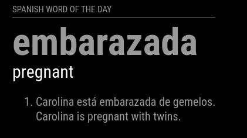
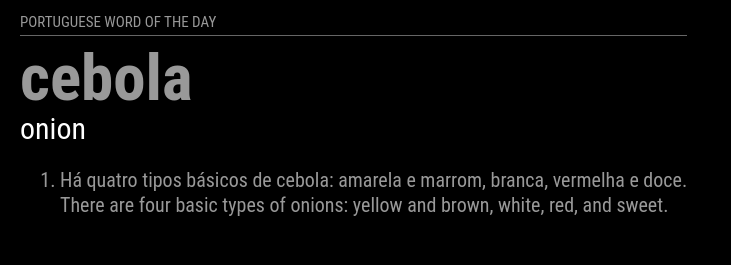
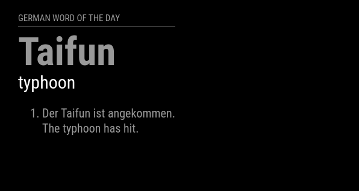

# MMM-WOTD


Yet another Word of the Day module for [MagicMirror²](https://magicmirror.builders). Difference with this one is that you can select `Spanish` or `Portuguese`. Other languages can be added at a later stage.

[](LICENSE)

## Spanish Example
 

## Portuguese Example
 

## German Example
 


## Dependencies
- axios@0.27.2
- cheerio@1.0.0-rc.10

## Installation

In your terminal, go to your MagicMirror's Module folder:
````
cd ~/MagicMirror/modules
````

Clone this repository:
````
git clone https://github.com/mumblebaj/MMM-WOTD.git
````
````
cd MMM-WOTD
npm install
````

Add the module to the modules array in the `config/config.js` file:
````javascript
        {
            module: 'MMM-WOTD',
            position: 'middle_center',
            config: {
                        updateInterval: 86400000,
                        retryDelay: 5000,
                        showExamples: true,
                        showExampleTranslations: true,
                        language: "spanish"
                    }
        },
````

## Configuration options

The following properties can be configured:


| Option                       | Description
| ---------------------------- | -----------
| `updateInterval`             | As this is a "Word of the Day" it is recommended to set the value to 24hrs (86400000)
| `retryDelay`                 | How long to wait before retry
| `showExamples`               | If you would like to see some example usages of the word set this to `true`. Default is `true` <br><br> **Possible values:** `true` or `false`
| `showExampleTranslations`    | If you want the example with its English translation set this to `true` <br><br> **Possible values:** `true` or `false`,
| `language`                   | Which language WOTD would you like? Currently on `Spanish` and `Portuguese` supported<br><br> **Possible values:** `spanish`, `portuguese`, `german`

## Updating

To update the module to the latest version, use your terminal to go to your MMM-WOTD module folder and type the following command:

````
cd MMM-WOTD
git pull
npm install
```` 

